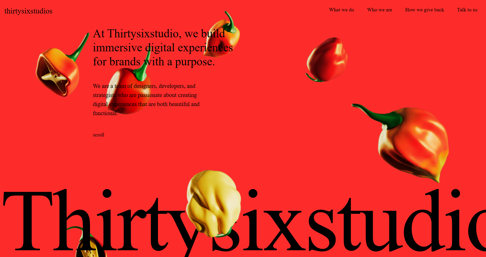

# thirtysixstudio



## About

**thirtysixstudio** is a modern, interactive portfolio website showcasing immersive digital experiences. This project demonstrates cutting-edge web animation techniques and smooth user interactions to create an engaging visual experience.

## Features

- **Interactive Canvas Animations**: Dynamic image sequence animations using HTML5 Canvas API displaying animated pepper visuals
- **Smooth Scrolling**: Implemented with Locomotive Scroll for a premium browsing experience
- **Click-to-Reveal Effect**: Engaging red circle animation that grows on click, toggling between dark and light themes
- **Responsive Design**: Fully responsive layout optimized for all device sizes
- **Modern Animations**: Powered by GSAP (GreenSock Animation Platform) for smooth, performant animations
- **Image Galleries**: Showcases work through carefully curated visual content

## Tech Stack

- **React 19** - Modern UI library
- **Vite** - Fast build tool and development server
- **GSAP** - Professional-grade animation library
- **Locomotive Scroll** - Smooth scrolling library
- **Tailwind CSS v4** - Utility-first CSS framework
- **Canvas API** - For rendering image sequences

## Project Structure

- `src/App.jsx` - Main application component with scroll animations and layout
- `src/Canvas.jsx` - Canvas component handling image sequence animations
- `src/canvasimages.js` - Image assets for canvas animations
- `src/data.js` - Content data for the website
- `src/index.css` - Global styles and Tailwind configuration

## Getting Started

### Prerequisites

- Node.js (v18 or higher recommended)
- npm or yarn

### Installation

1. Clone the repository
```bash
git clone <repository-url>
cd thirtysixstudio
```

2. Install dependencies
```bash
npm install
```

3. Start the development server
```bash
npm run dev
```

4. Open your browser and navigate to `http://localhost:5173`

## Build

To create a production build:

```bash
npm run build
```

The optimized files will be in the `dist` directory.

## Preview Production Build

```bash
npm run preview
```

## License

This project is part of a learning exercise for Three.js and modern web animations.